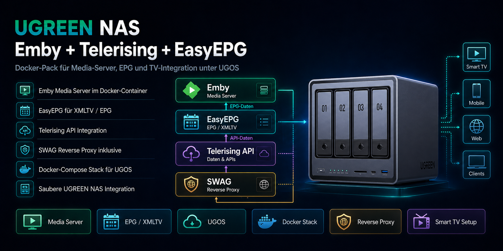

# Emby Telerising EasyEPG DockerPack für UGREEN NAS

[English](README_EN.md)

Dieses Repository enthält ein fertiges Docker-Projekt für **UGREEN NAS (UGOS Pro)**:
**Emby Media Server + SWAG (Reverse Proxy) + EasyEPG + Telerising**.

## Inhalt

- **de/**: deutsches Projekt + deutsches Handbuch (PDF)
- **en/**: englisches Projekt + englisches Handbuch (PDF)
- **release-assets/**: ZIPs für GitHub Releases (DE und EN)

## Features

- Emby Media Server (HTTP)
- SWAG (linuxserver/swag) als Reverse Proxy mit Fail2Ban
- EasyEPG für EPG-Generierung
- Telerising API für Live-TV Streams
- Docker Compose mit .env (Pfade, Ports, Domain, UID/GID)

## Schnellstart (UGREEN Docker App)

1. Lade die passende ZIP aus **Releases** herunter:
   - **DE**: `Emby_Telerising_EasyEPG_DockerPack_v1_de.zip`
   - **EN**: `Emby_Telerising_EasyEPG_DockerPack_v1_en.zip`

2. Entpacke die ZIP in dein Docker-Verzeichnis auf dem NAS.

3. Öffne die `.env` im Projektordner und passe mindestens an:
   - Pfade: `DOCKER_DIR`, `MEDIA_DIR`, `EMBY_SYSTEM_DIR`, optional `EMBY_BACKUP_DIR`
   - SWAG: `SWAG_URL`, `SWAG_EMAIL`, Subdomain
   - UID/GID: `PUID/PGID` und `EMBY_UID/EMBY_GID` (Standard meist ok)

4. Importiere das Projekt in der UGREEN Docker App und starte es.

## Standard-Ports (aus .env)

- Emby HTTP: **8096**
- Emby Discovery UDP: **7359**
- SWAG: **5080 (HTTP)**, **50443 (HTTPS)**, optional **8920** als Emby-SSL Listener
- EasyEPG: **4000**
- Telerising: **5000**

## Dokumentation

- Deutsch: `de/EmbyServer_Handbuch_DE_v1.pdf`
- Englisch: `en/EmbyServer_Handbuch_EN_v1.pdf`
